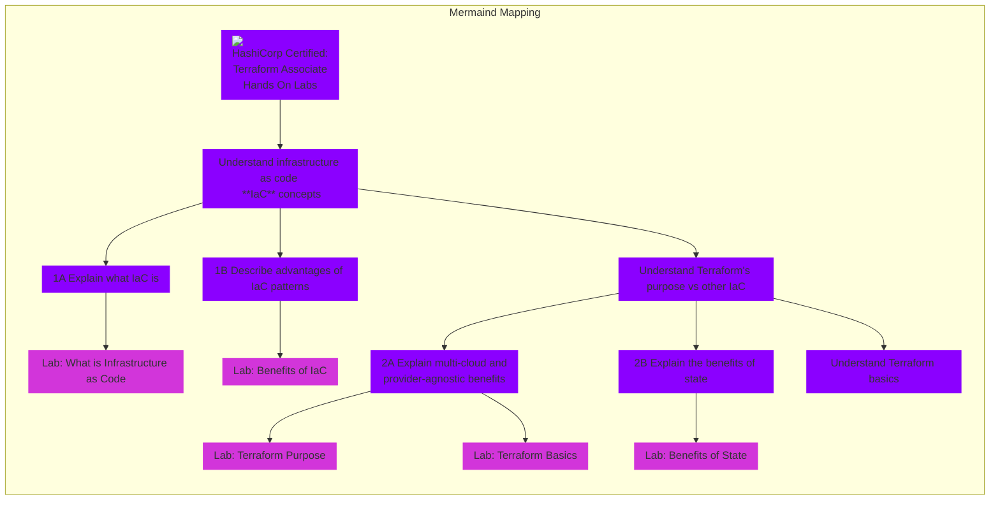

## Terraform Associate Certification Prep

Following [Terraform Hands on Lab Course](https://www.udemy.com/course/terraform-hands-on-labs) and [Repo](https://github.com/btkrausen/hashicorp)

| No  | Lab's Pull Requests | Documention |
| --- | ---------------- | ----------- |
| 1 | Theoretical Knowledge | Adding latter |
| 2 | [What is Infrastructure As Code (IaC) concepts](https://github.com/ilyesedina/Terraform/pull/2) | Adding latter |
| 3 | [Terraform Purpose](https://github.com/ilyesedina/Terraform/pull/4) | Adding latter | 
| 4 | [Understand Terraform Basics](https://github.com/ilyesedina/Terraform/pull/6) | Adding latter |
| 5 | [Use Terraform Outside of Core Workflow](https://github.com/ilyesedina/Terraform/pull/10) | Adding latter |
| 6 | [Interact with Terraform Modules](https://github.com/ilyesedina/Terraform/pull/11) | Adding latter |
| 7 | [Use the Core Terraform Workflow](https://github.com/ilyesedina/Terraform/pull/12) | Adding latter |
| 8 | [ Implement and Maintain State](https://github.com/ilyesedina/Terraform/pull/15) | Adding latter |
| 9 | [Read, Generate, and Modify Configuration](https://github.com/ilyesedina/Terraform/pull/17) | Adding latter |
| 10 | Understand Terraform Cloud Capabilities | Adding latter |
| 11 | Additional labs | Adding latter |
| 12 | Extra tips for the Exam | Adding latter |
| 13 | Final exam practice | Adding latter |

 

