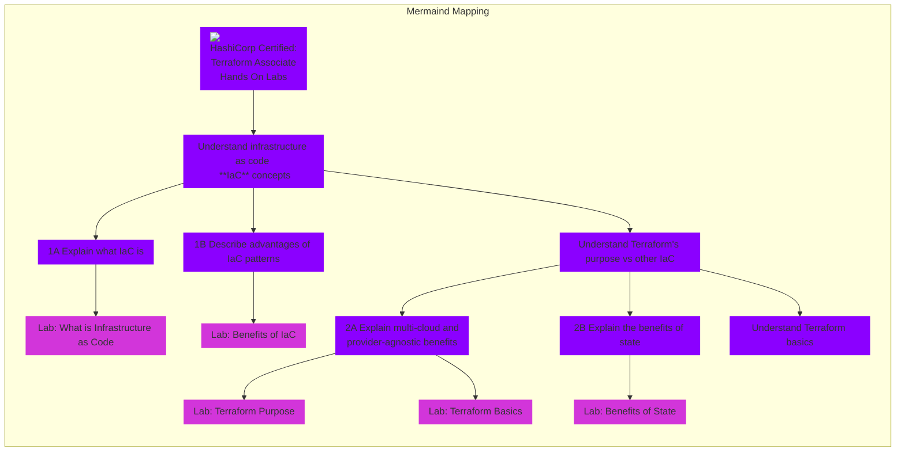

##Terraform Associate Certification

## [Course Link](https://www.udemy.com/course/terraform-hands-on-labs)
Discounts for the [Terraform Hands on Lab Course](https://www.udemy.com/course/terraform-hands-on-labs) and other HashiCorp courses can be found at the [HashiCorp Course Content and Discounts](https://github.com/btkrausen/hashicorp)

| **Objective**  | **Description** | Hands On Labs | Terraform Documentation | Quiz |
|---|-----------|-----------------|--------------------|------|
| **1** | **Understand Infrastructure as Code (IaC) concepts**| | | [Quiz - Understand infratructure as code (IaC) concepts](https://www.udemy.com/course/terraform-hands-on-labs/learn/quiz/5392970) |

 

